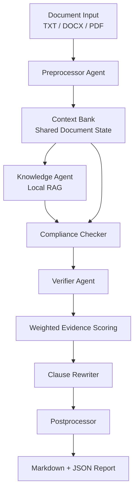

# ClauseGuard Agent

ClauseGuard Agent is an agentic legal document analysis framework for reviewing contracts, identifying compliance and consistency issues, and generating evidence-backed rewrite suggestions.

The project is inspired by the **SAUL** concept: Smart Agents for Understanding Law. Instead of treating a contract review as a single prompt, the system breaks the workflow into specialized agents for document preprocessing, legal knowledge retrieval, compliance analysis, verifier review, clause rewriting, and final reporting.

> This project is a legal analysis assistant for research and portfolio demonstration. It is not legal advice.

## Project Goal

Legal review is often a multi-step process: read the document, identify important clauses, compare obligations against legal or policy references, flag risks, propose safer language, and summarize the result for a human reviewer.

ClauseGuard Agent automates that workflow as a reproducible pipeline:

- Parse legal documents into structured clauses and entities.
- Detect missing clauses, risky wording, broad indemnity language, vague obligations, and internal inconsistencies.
- Retrieve supporting reference material through a local RAG layer.
- Verify candidate findings with an independent verifier model.
- Score each issue using transparent weighted evidence.
- Suggest clause rewrites while preserving the original business intent.
- Produce a clean Markdown and JSON report for review.

## Architecture



## Agent Responsibilities

| Component | Responsibility |
|---|---|
| Document Loader | Reads `.txt`, `.docx`, and `.pdf` files and normalizes extracted text. |
| Preprocessor Agent | Classifies document type, extracts ordered clauses, identifies entities, and tags risk terms. |
| Context Bank | Stores document text, clauses, entities, evidence, findings, rewrites, and report state. |
| Knowledge Agent | Retrieves relevant legal checklist evidence through local vector search. |
| Compliance Checker | Flags missing provisions, risky language, broad indemnity, vague payment terms, assignment risk, and termination risk. |
| Verifier Agent | Performs an independent second-model review of candidate findings. |
| Weighted Scoring | Combines rule checks, retrieved evidence, model reasoning, verifier agreement, and clause structure. |
| Clause Rewriter | Generates safer alternatives for accepted clause-level findings. |
| Postprocessor | Produces Markdown and JSON reports with evidence, confidence scores, and limitations. |

## Key Features

- Multi-agent legal review workflow
- Structured clause extraction and document classification
- Shared context memory across agents
- Local retrieval-augmented generation for legal reference evidence
- Independent verifier review for candidate issues
- Transparent weighted confidence scoring
- Automated clause rewrite suggestions
- Markdown and JSON report generation
- Mock-model mode for deterministic local demos

## Weighted Evidence Scoring

The system does not fine-tune model weights. It applies a transparent scoring layer over multiple evidence sources:

```text
deterministic legal/rule checks       30%
retrieved evidence/RAG match          25%
primary model reasoning               20%
verifier agreement                    15%
clause structure/consistency          10%
```

Each accepted finding includes the component scores and final confidence score, so the report shows why an issue was accepted rather than simply returning a model opinion.

## Example Output

A generated report includes:

- Contract summary
- Extracted clause list
- Detected findings
- Severity level
- Supporting evidence
- Component confidence scores
- Verifier confidence
- Suggested clause rewrites
- Legal-assistant limitations

See [examples/sample_report.md](examples/sample_report.md) for a sample report.

## Installation

```bash
python -m venv venv
venv\Scripts\activate
pip install -r requirements.txt
```

Create a `.env` file from `.env.example` and add the required model provider keys:

```env
GROQ_API_KEY=your_groq_key_here
```

Additional model and usage settings are available in `.env.example`.

## Model Configuration

Default generation roles use Groq-hosted models, while retrieval uses a local deterministic embedding strategy:

| Role | Default |
|---|---|
| Extraction | `llama-3.1-8b-instant` |
| Reasoning and rewrites | `llama-3.3-70b-versatile` |
| Verifier review | `openai/gpt-oss-120b` |
| Retrieval embeddings | `local-hash-lexical` |

Model IDs and per-run request/token caps can be changed through `.env.example`.

Current model-role validation:

| Role | Current Fit |
|---|---|
| Extraction | Works for structured JSON extraction, but can summarize longer contracts. The preprocessor keeps deterministic full-document clause extraction when model output is partial. |
| Reasoning and rewrites | Produces usable issue explanations, confidence updates, and rewrite suggestions in the current sample runs. |
| Verifier review | Produces useful agreement/confidence scores after receiving compact document context and evidence. |
| Retrieval embeddings | Runs locally with no external API calls. It supports checklist-style evidence retrieval and is covered by the local benchmark workflow. |

## Usage

Run the included demo contract with deterministic mock responses:

```bash
python -m legal_lm analyze examples\demo_contract.txt --mock-models
```

Run a real model-backed analysis:

```bash
python -m legal_lm analyze examples\demo_contract.txt
```

Analyze one of the bundled sample contracts:

```bash
python -m legal_lm analyze "Original_files\ABILITYINC_06_15_2020-EX-4.25-SERVICES AGREEMENT.txt"
```

Reports are written to:

```text
analysis_outputs/analysis_report.json
analysis_outputs/analysis_report.md
```

Show the configured model roles:

```bash
python -m legal_lm models
```

## Benchmark Evaluation

The project includes two local benchmark paths. Both default to mock/local model behavior and do not call Groq.

Build the repo-dataset benchmark from the included original/modified perturbation files:

```bash
python -m legal_lm build-dataset-benchmark
```

Run the dataset-backed benchmark:

```bash
python -m legal_lm evaluate benchmarks\repo_dataset_benchmark.jsonl --mock-models
```

Run the smaller seed benchmark:

```bash
python -m legal_lm evaluate benchmarks\seed_contracts.jsonl --mock-models
```

This writes:

```text
analysis_outputs/benchmark_evaluation/benchmark_evaluation.json
analysis_outputs/benchmark_evaluation/benchmark_evaluation.md
```

Real-model benchmark evaluation is opt-in and capped to one case by default:

```bash
python -m legal_lm evaluate benchmarks\seed_contracts.jsonl --real-models --max-cases 1
```

The evaluator records the configured per-run model caps and the local usage snapshot in the output report. Use `python -m legal_lm models` before any real-model benchmark run to confirm the active models and caps.

Current local benchmark results:

| Benchmark | Cases | Expected Label Instances | Precision | Recall | F1 | API Calls |
|---|---:|---:|---:|---:|---:|---:|
| Seed benchmark | 3 | 10 | `1.0000` | `1.0000` | `1.0000` | 0 |
| Repo perturbation dataset | 11 | 20 case-level labels | `0.6154` | `0.8000` | `0.6957` | 0 |

The repo dataset result shows strong recall for contradiction-style changes. Extra legal risks outside the dataset label set are reported separately instead of being counted as benchmark false positives.

## Project Structure

```text
legal_lm/
  agents/              # v1 agent implementations
  cli.py               # command-line entrypoint
  config.py            # environment and model configuration
  context.py           # shared analysis state
  document.py          # TXT / DOCX / PDF loading
  model_router.py      # provider calls and usage guards
  pipeline.py          # end-to-end orchestration
  rag.py               # local retrieval layer
  scoring.py           # weighted evidence scoring
  schemas.py           # Pydantic data models

agents/                # legacy experimental agent modules
benchmarks/            # Labeled benchmark fixtures
docs/                  # architecture, dataset inventory, and release notes
examples/              # demo input and sample output
tests/                 # unit and smoke tests
```

## Validation

```bash
python -m pytest -q
python -m compileall legal_lm agents context_bank.py
python scripts/check_publish_ready.py
```

Optional real-provider smoke test:

```bash
python scripts/smoke_groq.py
```

Current validation status:

- 24 tests pass.
- Syntax compilation passes.
- Cloud smoke test has passed for Groq-backed extraction, reasoning, and verifier roles.
- Retrieval uses local deterministic embeddings, so it does not call an external embedding API.
- Full pipeline smoke tests generated Markdown and JSON reports successfully for the demo contract and two additional bundled contracts.
- Seed and repo-dataset benchmarks run in mock/local mode without consuming Groq requests.

Current project metrics:

| Metric | Current Value |
|---|---|
| Supported input types | `.txt`, `.docx`, `.pdf` |
| Agent workflow stages | Preprocessor, Knowledge/RAG, Compliance Checker, Verifier, Clause Rewriter, Postprocessor |
| Model roles | 3 Groq generation roles + 1 local retrieval role |
| Tests | 24 passing tests |
| Real validation samples | Demo contract, consulting agreement, joint venture agreement |
| Seed benchmark | 3 labeled cases, 10 expected issue labels, mock/local precision `1.0000`, recall `1.0000`, F1 `1.0000` |
| Repo dataset benchmark | 11 cases from 31 perturbation records, mock/local precision `0.6154`, recall `0.8000`, F1 `0.6957` |

The benchmark numbers are metrics for mapped issue labels, not broad legal accuracy. The repo dataset benchmark is useful for tracking progress, especially contradiction recall and false-positive reduction.

## License

This project code is released under the MIT License. Bundled benchmark and contract-derived sample files are included for research and portfolio demonstration; review their source terms before reusing them outside this project.

## Current Scope

ClauseGuard Agent is currently a functional v1 prototype. It demonstrates agentic workflow design, legal document parsing, RAG-style retrieval, verifier patterns, scoring transparency, and report generation.

Planned future work:

- Expanded evaluation against CLAUSE/CUAD/ContractNLI-style benchmarks
- Expanded jurisdiction-aware legal reference retrieval
- Better contradiction classification
- Richer span-level citations
- Web or desktop UI for reviewing findings interactively

## Limitations

- The system is not a substitute for a licensed attorney.
- Findings should be reviewed by a qualified legal professional.
- Model responses can be incomplete or incorrect.
- The included local legal references are checklist-style references, not a complete statutory database.
- The legacy `agents/` folder contains earlier experimental modules; the production-style v1 path is under `legal_lm/`.
