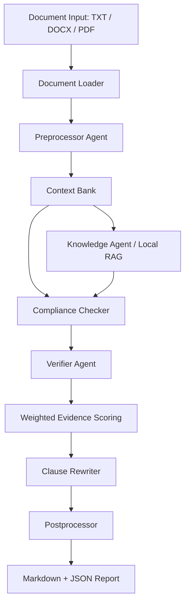

# ClauseGuard Agent

AI-assisted contract analysis system for reviewing legal documents, detecting clause-level risks, scoring evidence, verifying findings, and generating structured Markdown and JSON reports.

ClauseGuard Agent is inspired by the SAUL concept: Smart Agents for Understanding Law. Instead of treating contract review as one large prompt, the system breaks the workflow into specialized stages for document loading, preprocessing, retrieval, compliance analysis, verifier review, clause rewriting, and final reporting.

> This project is a legal analysis assistant for research and portfolio demonstration. It is not legal advice.

## Project Goal

Legal review is usually a multi-step process:

* Read and structure the document
* Identify important clauses and entities
* Compare obligations against legal or policy references
* Detect risky wording, missing provisions, and inconsistencies
* Verify candidate findings before accepting them
* Suggest safer clause rewrites
* Generate a report that a human reviewer can inspect

ClauseGuard Agent turns that process into a reproducible software pipeline with transparent scoring and validation.

## Why This Is Not Just an LLM Wrapper

This project does not simply send a contract to an LLM and return a summary.

It uses a controlled workflow with:

* Document parsing and clause extraction
* Shared analysis state through a context bank
* Local retrieval for legal checklist evidence
* Rule-based and model-assisted compliance checks
* Independent verifier review
* Weighted evidence scoring
* Structured Pydantic schemas
* Deterministic mock-model mode for local demos
* Markdown and JSON report generation
* Unit tests, smoke tests, and benchmark evaluation

The LLM is used as one part of the system, not as the entire decision-making process.

## Architecture



## Pipeline Overview

| Stage              | Responsibility                                                                                                      |
| ------------------ | ------------------------------------------------------------------------------------------------------------------- |
| Document Loader    | Reads `.txt`, `.docx`, and `.pdf` files and normalizes extracted text                                               |
| Preprocessor Agent | Classifies document type, extracts clauses, identifies entities, and tags risk terms                                |
| Context Bank       | Stores document text, clauses, entities, evidence, findings, rewrites, and report state                             |
| Knowledge Agent    | Retrieves relevant legal checklist evidence using local vector-style retrieval                                      |
| Compliance Checker | Flags missing provisions, risky language, vague obligations, broad indemnity, assignment risk, and termination risk |
| Verifier Agent     | Performs an independent review of candidate findings                                                                |
| Weighted Scoring   | Combines rules, retrieved evidence, model reasoning, verifier agreement, and clause structure                       |
| Clause Rewriter    | Generates safer alternatives for accepted clause-level findings                                                     |
| Postprocessor      | Produces Markdown and JSON reports with evidence, confidence scores, and limitations                                |

## Key Features

* Multi-stage agentic legal review workflow
* TXT, DOCX, and PDF contract input support
* Structured clause extraction and document classification
* Shared context memory across pipeline stages
* Local retrieval-augmented generation for checklist-style legal evidence
* Independent verifier review for candidate issues
* Transparent weighted confidence scoring
* Clause rewrite suggestions for accepted findings
* Markdown and JSON report generation
* Mock-model mode for deterministic local demos
* Benchmark evaluation workflows
* Unit and smoke test validation

## Weighted Evidence Scoring

ClauseGuard applies a transparent scoring layer over multiple evidence sources.

```text
deterministic legal/rule checks      30%
retrieved evidence/RAG match         25%
primary model reasoning              20%
verifier agreement                   15%
clause structure/consistency         10%
```

Each accepted finding includes component scores and a final confidence score, so the report explains why an issue was accepted instead of returning only a model opinion.

## Example Output

A generated report includes:

* Contract summary
* Extracted clause list
* Detected findings
* Severity level
* Supporting evidence
* Component confidence scores
* Verifier confidence
* Suggested clause rewrites
* Legal assistant limitations

See the sample report:

[examples/sample_report.md](examples/sample_report.md)

## Tech Stack

| Area           | Technologies                          |
| -------------- | ------------------------------------- |
| Language       | Python                                |
| CLI            | Python module entry point             |
| Data Models    | Pydantic                              |
| Retrieval      | Local hash/lexical retrieval          |
| LLM Providers  | Groq-compatible model roles           |
| Evaluation     | Local benchmark workflows             |
| Testing        | pytest, compile checks, smoke scripts |
| Output Formats | Markdown, JSON                        |
| Document Input | TXT, DOCX, PDF                        |

## Model Configuration

Default generation roles use Groq-hosted models, while retrieval uses a local deterministic embedding strategy.

| Role                   | Default                   |
| ---------------------- | ------------------------- |
| Extraction             | `llama-3.1-8b-instant`    |
| Reasoning and rewrites | `llama-3.3-70b-versatile` |
| Verifier review        | `openai/gpt-oss-120b`     |
| Retrieval embeddings   | `local-hash-lexical`      |

Model IDs and per-run request/token caps can be changed through `.env.example`.

## Installation

```bash
python -m venv venv
venv\Scripts\activate
pip install -r requirements.txt
```

Create a `.env` file from `.env.example`:

```env
GROQ_API_KEY=your_groq_key_here
```

Additional model and usage settings are available in `.env.example`.

## Usage

Run the included demo contract with deterministic mock responses:

```bash
python -m legal_lm analyze examples\demo_contract.txt --mock-models
```

Run a real model-backed analysis:

```bash
python -m legal_lm analyze examples\demo_contract.txt
```

Analyze one of the bundled sample contracts:

```bash
python -m legal_lm analyze "Original_files\ABILITYINC_06_15_2020-EX-4.25-SERVICES AGREEMENT.txt"
```

Reports are written to:

```text
analysis_outputs/analysis_report.json
analysis_outputs/analysis_report.md
```

Show the configured model roles:

```bash
python -m legal_lm models
```

## Benchmark Evaluation

The project includes local benchmark paths that can run in mock/local mode without consuming Groq requests.

Build the repo-dataset benchmark:

```bash
python -m legal_lm build-dataset-benchmark
```

Run the dataset-backed benchmark:

```bash
python -m legal_lm evaluate benchmarks\repo_dataset_benchmark.jsonl --mock-models
```

Run the smaller seed benchmark:

```bash
python -m legal_lm evaluate benchmarks\seed_contracts.jsonl --mock-models
```

Benchmark reports are written to:

```text
analysis_outputs/benchmark_evaluation/benchmark_evaluation.json
analysis_outputs/benchmark_evaluation/benchmark_evaluation.md
```

Real-model benchmark evaluation is opt-in and capped to one case by default:

```bash
python -m legal_lm evaluate benchmarks\seed_contracts.jsonl --real-models --max-cases 1
```

Use this command before any real-model benchmark run to confirm active models and caps:

```bash
python -m legal_lm models
```

## Current Benchmark Results

| Benchmark                 | Cases | Expected Label Instances | Precision |   Recall |       F1 | API Calls |
| ------------------------- | ----: | -----------------------: | --------: | -------: | -------: | --------: |
| Seed benchmark            |     3 |                       10 |  `1.0000` | `1.0000` | `1.0000` |         0 |
| Repo perturbation dataset |    11 |     20 case-level labels |  `0.6154` | `0.8000` | `0.6957` |         0 |

The benchmark numbers are metrics for mapped issue labels, not broad legal accuracy. The repo dataset benchmark is useful for tracking progress, especially contradiction recall and false-positive reduction.

## Project Structure

```text
legal_lm/
├── agents/              # v1 agent implementations
├── cli.py               # command-line entry point
├── config.py            # environment and model configuration
├── context.py           # shared analysis state
├── document.py          # TXT / DOCX / PDF loading
├── model_router.py      # provider calls and usage guards
├── pipeline.py          # end-to-end orchestration
├── rag.py               # local retrieval layer
├── scoring.py           # weighted evidence scoring
└── schemas.py           # Pydantic data models

agents/                  # legacy experimental agent modules
benchmarks/              # labeled benchmark fixtures
docs/                    # architecture, dataset inventory, and release notes
examples/                # demo input and sample output
tests/                   # unit and smoke tests
scripts/                 # validation and smoke scripts
```

## Validation

Run tests:

```bash
python -m pytest -q
```

Run syntax compilation:

```bash
python -m compileall legal_lm agents context_bank.py
```

Run publish-readiness checks:

```bash
python scripts/check_publish_ready.py
```

Optional real-provider smoke test:

```bash
python scripts/smoke_groq.py
```

## Current Validation Status

* 24 tests pass
* Syntax compilation passes
* Full pipeline smoke tests generate Markdown and JSON reports
* Retrieval uses local deterministic embeddings, so it does not call an external embedding API
* Seed and repo-dataset benchmarks run in mock/local mode without consuming Groq requests
* Cloud smoke test has passed for Groq-backed extraction, reasoning, and verifier roles

## Current Project Metrics

| Metric                  | Current Value                                                                                          |
| ----------------------- | ------------------------------------------------------------------------------------------------------ |
| Supported input types   | `.txt`, `.docx`, `.pdf`                                                                                |
| Agent workflow stages   | Preprocessor, Knowledge/RAG, Compliance Checker, Verifier, Clause Rewriter, Postprocessor              |
| Model roles             | 3 Groq generation roles + 1 local retrieval role                                                       |
| Tests                   | 24 passing tests                                                                                       |
| Real validation samples | Demo contract, consulting agreement, joint venture agreement                                           |
| Seed benchmark          | 3 labeled cases, 10 expected issue labels, mock/local precision `1.0000`, recall `1.0000`, F1 `1.0000` |
| Repo dataset benchmark  | 11 cases from 31 perturbation records, mock/local precision `0.6154`, recall `0.8000`, F1 `0.6957`     |

## Responsible AI and Legal Scope

ClauseGuard Agent is a research and portfolio prototype. It is intended to demonstrate agentic workflow design, legal document parsing, RAG-style retrieval, verifier patterns, scoring transparency, and report generation.

It should not be used as a substitute for a licensed attorney.

## Limitations

* Findings should be reviewed by a qualified legal professional
* Model responses can be incomplete or incorrect
* The included local legal references are checklist-style references, not a complete statutory database
* Benchmark results measure mapped issue labels, not full legal correctness
* The legacy `agents/` folder contains earlier experimental modules
* The production-style v1 path is under `legal_lm/`

## Future Work

Planned improvements may include:

* Expanded evaluation against CLAUSE, CUAD, or ContractNLI-style benchmarks
* Expanded jurisdiction-aware legal reference retrieval
* Better contradiction classification
* Richer span-level citations
* Web or desktop UI for reviewing findings interactively
* Improved report comparison across contract versions

## License

This project code is released under the MIT License.

Bundled benchmark and contract-derived sample files are included for research and portfolio demonstration. Review their source terms before reusing them outside this project.
