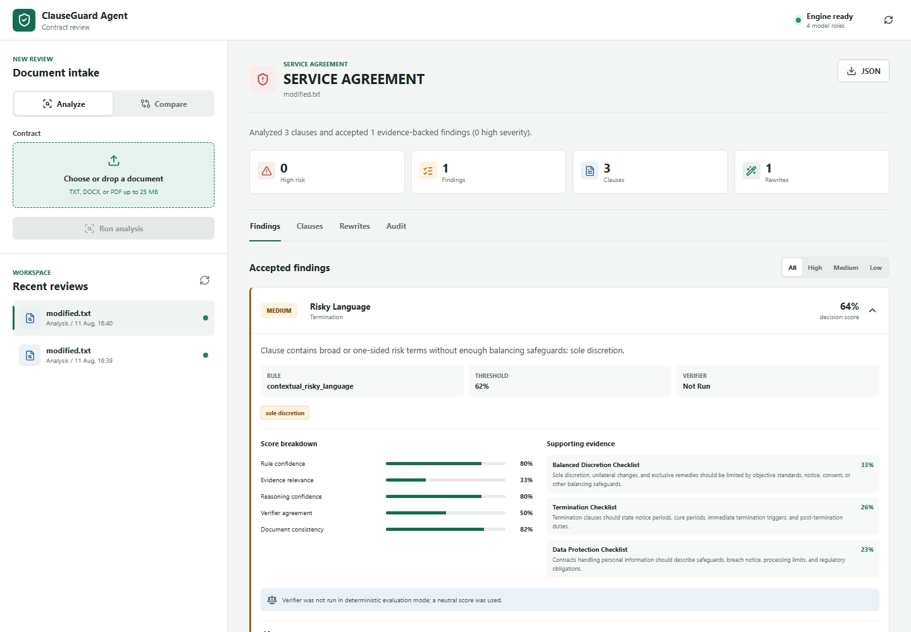
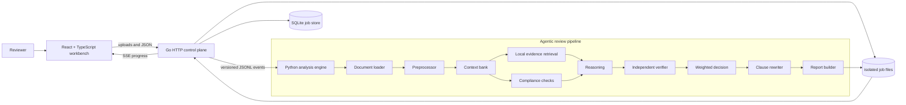

# ClauseGuard Agent

[](https://github.com/arpitJ-dev/ClauseGuard-Agent/actions/workflows/ci.yml)
[](https://github.com/arpitJ-dev/ClauseGuard-Agent/actions/workflows/codeql.yml)


[](LICENSE)

**An agentic contract-review workbench that turns legal documents into traceable risk findings, supporting evidence, decision scores, and suggested clause rewrites.**

ClauseGuard Agent combines deterministic contract checks, local retrieval, specialized model roles, independent verification, and transparent weighted scoring. A React workbench drives a Go control plane, which runs the Python analysis engine through a versioned event protocol and persists review jobs in SQLite.



## Why ClauseGuard

Single-prompt contract review is difficult to audit: the extraction, legal reasoning, confidence, and rewrite can all fail inside one opaque response. ClauseGuard decomposes that workflow into explicit stages and keeps the supporting state attached to every finding.

- Ingests `.txt`, `.docx`, and `.pdf` agreements while preserving source order.
- Extracts clauses, parties, dates, obligations, jurisdictions, monetary terms, and risk language.
- Detects missing provisions, ambiguous obligations, one-sided discretion, internal contradictions, terminology drift, structural defects, and risk-allocation issues.
- Retrieves issue-specific evidence from a local reference corpus.
- Routes candidate findings through an independent verifier role.
- Accepts or rejects findings with an inspectable five-component score.
- Drafts replacement language while retaining the affected clause and rationale.
- Supports standalone review and isolated original-versus-modified comparison.
- Exposes live progress, report navigation, JSON export, job history, and cancellation in the browser.

## Architecture


```mermaid
flowchart LR
    U["Reviewer"] --> W["React + TypeScript workbench"]
    W -->|"uploads and JSON"| A["Go HTTP control plane"]
    A -->|"SSE progress"| W
    A --> J[("SQLite job store")]
    A --> F[("isolated job files")]
    A -->|"versioned JSONL events"| P["Python analysis engine"]

    subgraph Pipeline["Agentic review pipeline"]
        P --> L["Document loader"]
        L --> X["Preprocessor"]
        X --> C["Context bank"]
        C --> R["Local evidence retrieval"]
        C --> D["Compliance checks"]
        R --> M["Reasoning"]
        D --> M
        M --> V["Independent verifier"]
        V --> S["Weighted decision"]
        S --> Q["Clause rewriter"]
        Q --> O["Report builder"]
    end

    O --> F
    F --> A
```

The Go service owns transport and lifecycle concerns: upload validation, queue capacity, process timeouts, cancellation, job recovery, persistence, and production web serving. The Python engine owns legal document analysis. Their JSON-lines protocol keeps the boundary language-neutral and makes progress and failure states observable.

See [Architecture](docs/ARCHITECTURE.md) for component contracts, schemas, failure semantics, and evaluation isolation.

## Analysis Pipeline

| Stage | Responsibility | Traceable output |
|---|---|---|
| Document loader | Validates and normalizes TXT, DOCX, and PDF input | Ordered source text and metadata |
| Preprocessor | Classifies the agreement and extracts clauses and entities | Stable clause IDs, categories, parties, dates, and terms |
| Knowledge agent | Ranks checklist references with lexical and feature-hashed similarity | Clause- and issue-linked evidence |
| Compliance checker | Applies deterministic and contextual review rules | Candidate findings, rule IDs, and detected signals |
| Reasoning role | Explains candidate risks in contract context | Rationale and primary confidence |
| Verifier agent | Reviews candidates through an independent model route | Agreement score, status, and verifier rationale |
| Weighted scorer | Combines five evidence channels with issue-specific thresholds | Accepted and rejected findings |
| Clause rewriter | Produces balanced alternatives for accepted risks | Replacement language and change explanation |
| Postprocessor | Validates and serializes the analysis state | Browser report, Markdown, and JSON |

All stages write structured objects into a shared `ContextBank`. Clause IDs, evidence IDs, rule identifiers, component scores, verifier decisions, and rewrites remain linked through the final report.

## Explainable Decisions

ClauseGuard does not treat raw model confidence as the final decision. It computes a transparent score for each candidate:

```text
final score =
    0.30 * deterministic rule confidence
  + 0.25 * retrieved evidence relevance
  + 0.20 * primary reasoning confidence
  + 0.15 * verifier agreement
  + 0.10 * document consistency
```

Issue-specific thresholds make broad categories such as risky language and terminology drift harder to accept than high-signal structural checks. Reports retain every component, threshold, signal, evidence item, and acceptance decision.

## Evaluation

ClauseGuard includes two versioned regression suites. Evaluation is performed at the case-level issue-type boundary: an expected category counts once per contract, and duplicate findings cannot inflate the score.

| Suite | Cases | Expected labels | TP | FP | FN | Precision | Recall | F1 |
|---|---:|---:|---:|---:|---:|---:|---:|---:|
| Focused seed contracts | 3 | 10 | 10 | 0 | 0 | `1.0000` | `1.0000` | `1.0000` |
| Repository perturbation suite | 11 | 19 | 18 | 0 | 1 | `1.0000` | `0.9474` | `0.9730` |

The repository suite is generated from 31 labeled perturbation records. During evaluation, ClauseGuard receives only the modified agreement. Original contracts and change metadata remain label provenance and are used separately by comparison mode, preventing paired-document leakage into precision, recall, and F1.

```text
precision = TP / (TP + FP) = 18 / 18 = 1.0000
recall    = TP / (TP + FN) = 18 / 19 = 0.9474
F1        = 2 * precision * recall / (precision + recall) = 0.9730
```

Per-case errors, per-issue metrics, unmatched findings, and provenance are written with every evaluation run. Dataset sources and redistribution boundaries are documented in [Dataset Notice](data/NOTICE.md).

## Run the Demo

### Prerequisites

- Python 3.11+
- Go 1.25+
- Node.js 22+

### Browser Workbench

```bash
git clone https://github.com/arpitJ-dev/ClauseGuard-Agent.git
cd ClauseGuard-Agent
python -m venv .venv
```

Activate the environment and install the Python package:

```powershell
# Windows PowerShell
.\.venv\Scripts\Activate.ps1
python -m pip install -e .
```

```bash
# macOS or Linux
source .venv/bin/activate
python -m pip install -e .
```

Start the production-style demo:

```bash
python scripts/start_demo.py
```

Open `http://127.0.0.1:8080`. The launcher installs missing frontend packages, builds the React application, and starts the Go server with deterministic model responses so the complete workflow is reproducible.

For configured hosted-model execution, complete the settings in `.env.example` and run:

```bash
python scripts/start_demo.py --live-models
```

### Command Line

Run a standalone review:

```bash
clauseguard analyze examples/demo_contract.txt --mock-models --output-dir analysis_outputs/demo
```

Compare two contract versions:

```bash
clauseguard compare path/to/original.txt path/to/modified.txt --output-dir analysis_outputs/comparison
```

Reproduce the bundled evaluation:

```bash
clauseguard evaluate benchmarks/repo_dataset_benchmark.jsonl --mock-models
```

The CLI emits human-readable progress by default and supports a versioned JSONL event stream for process integrations. See the [sample report](examples/sample_report.md) for the Markdown output.

## Model Orchestration

Model access is centralized behind `ModelRouter`; agents never call a provider directly.

| Role | Purpose |
|---|---|
| Structured extraction | Contract classification, clause parsing, and JSON normalization |
| Primary reasoning | Contextual risk explanation and rewrite drafting |
| Independent verification | Separate review of each candidate finding |
| Local retrieval | Deterministic evidence ranking without a hosted vector database |

Each hosted role has a per-run request cap and input-token cap. Configuration errors, exhausted caps, quota responses, malformed structured output, and provider failures surface as explicit application errors rather than silent fallbacks.

## Engineering Quality

| Layer | Current quality signal |
|---|---|
| Python engine | 83 tests; `84.32%` branch-aware coverage; Black, isort, Flake8, and mypy |
| Go control plane | 56 test functions; `71.0%` statement coverage; vet and build; CI race-detector job |
| React workbench | 31 component/integration tests; `81.37%` statement and `70.86%` branch coverage |
| Production browser flow | 4 Playwright executions across desktop and mobile viewports |
| Security automation | Python, npm, and Go dependency audits; CodeQL for Python, Go, and TypeScript; Dependabot |

The browser journeys build the production bundle, launch the real Go server, invoke the Python engine, upload contracts, observe SSE progress, inspect reports, and cover both analysis and comparison workflows.

Run the local quality gates:

```bash
python -m pytest --cov=clauseguard --cov-branch
python -m mypy clauseguard
python -m flake8 clauseguard tests scripts

cd apps/server && go test -race ./... && go vet ./...
cd ../web && npm run lint && npm run test:coverage && npm run test:e2e
```

## Security and Failure Handling

- Uploads are isolated by job and restricted by extension and size.
- Document parsing bounds source bytes, DOCX expansion and entry count, PDF pages, and extracted text.
- Hosted prompts mark document content as untrusted data to reduce instruction-injection risk.
- API responses use `no-store`; the web application applies CSP, same-origin resource policy, frame protection, and restrictive browser permissions.
- The server binds to loopback by default and enforces queue, concurrency, process-output, and timeout limits.
- Interrupted jobs are recovered into a terminal state instead of remaining indefinitely active.

See [Security Policy](SECURITY.md) for deployment boundaries and vulnerability reporting.

## Repository Map

```text
apps/
  server/                  Go API, job manager, SQLite store, Python bridge
  web/                     React workbench, component tests, Playwright journeys
clauseguard/
  agents/                  preprocessing, compliance, verification, rewriting
  cli.py                   analysis, comparison, evaluation, and protocol commands
  comparison.py            isolated original-versus-modified inspection
  context.py               normalized shared analysis state
  dataset_benchmark.py     dataset-to-benchmark builder
  document.py              bounded TXT, DOCX, and PDF ingestion
  evaluation.py            precision, recall, F1, and error analysis
  model_router.py          role routing, caps, and structured responses
  pipeline.py              end-to-end orchestration
  rag.py                   local evidence retrieval
  schemas.py               Pydantic contracts
  scoring.py               weighted acceptance logic
benchmarks/                versioned regression manifests
data/                      selected contract perturbations and provenance
docs/                      architecture and dataset documentation
examples/                  runnable contract and sample report
scripts/                   demo launcher, smoke checks, publish validation
tests/                     Python unit, integration, and regression tests
```

## Responsible Use

ClauseGuard is a contract-review decision-support system. Its reports are designed for inspection by a human reviewer and should be validated by a qualified legal professional before they influence negotiations, compliance decisions, or legal obligations.

## License

ClauseGuard source code is released under the [MIT License](LICENSE). Bundled contract and perturbation artifacts retain their upstream terms; see [data/NOTICE.md](data/NOTICE.md) before redistributing dataset files.
