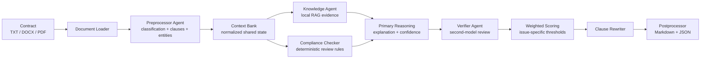

# ClauseGuard Agent


**Agentic contract risk analysis with evidence retrieval, separate-model verification, transparent scoring, and clause rewrites.**

ClauseGuard Agent turns `.txt`, `.docx`, and `.pdf` contracts into structured, auditable review reports. Instead of asking one language model to review an entire agreement in a single prompt, it coordinates specialized agents and combines deterministic contract-review rules, local retrieval, model reasoning, verifier agreement, and document-structure signals.

The project originated from the SAUL idea, "Smart Agents for Understanding Law," and develops that concept into a testable software system rather than a single-prompt LLM wrapper.

The result is a review workflow that identifies risky or missing language, cites supporting evidence, explains its confidence, and proposes safer wording while aiming to preserve the original business intent.

> ClauseGuard supports legal review; it does not provide legal advice or replace a qualified attorney.

## Results at a Glance

| Capability | Verified result |
|---|---:|
| Supported document formats | `.txt`, `.docx`, `.pdf` |
| Specialized pipeline agents | 6 |
| Automated tests | 54 passing |
| Statement and branch coverage | 83% |
| Repo benchmark cases | 11 |
| Expected benchmark labels | 19 |
| Repo benchmark precision | `1.0000` |
| Repo benchmark recall | `0.9474` |
| Repo benchmark F1 | `0.9730` |

Detailed benchmark design and metric definitions are documented in [Evaluation](#evaluation).

## What ClauseGuard Does

- Loads contracts while preserving clause order and source text.
- Classifies contract type, segments clauses, categorizes provisions, and extracts organizations, dates, monetary values, jurisdictions, and risk terms.
- Detects missing provisions, ambiguous obligations, one-sided discretion, internal contradictions, structural defects, terminology drift, and risk-allocation issues.
- Retrieves relevant checklist evidence from a local reference corpus.
- Sends candidate findings through a separate verifier model before acceptance.
- Calculates an explainable confidence score from five independently visible components.
- Drafts safer alternatives for accepted clause-level findings.
- Produces human-readable Markdown and machine-readable JSON reports.
- Evaluates standalone detection against labeled contracts without using original-document text as prediction input.
- Compares original and modified agreements in a separate inspection workflow.

## Architecture


```mermaid
flowchart LR
    A["Contract<br/>TXT / DOCX / PDF"] --> B["Document Loader"]
    B --> C["Preprocessor Agent<br/>classification + clauses + entities"]
    C --> D["Context Bank<br/>normalized shared state"]
    D --> E["Knowledge Agent<br/>local RAG evidence"]
    D --> F["Compliance Checker<br/>deterministic review rules"]
    E --> G["Primary Reasoning<br/>explanation + confidence"]
    F --> G
    G --> H["Verifier Agent<br/>second-model review"]
    H --> I["Weighted Scoring<br/>issue-specific thresholds"]
    I --> J["Clause Rewriter"]
    J --> K["Postprocessor<br/>Markdown + JSON"]
```

The `ContextBank` is the shared contract state. Each stage adds structured data rather than passing unvalidated prose between agents, which keeps clause IDs, evidence, findings, scores, and rewrites traceable through the complete run.

See the [architecture deep dive](docs/ARCHITECTURE.md) for component contracts, failure semantics, retrieval design, and evaluation isolation.

## Agent Workflow

| Stage | Responsibility | Output |
|---|---|---|
| Document Loader | Extracts and normalizes source text | Ordered document text |
| Preprocessor Agent | Classifies the agreement and extracts structured clauses and entities | Clauses, categories, parties, dates, risk terms |
| Knowledge Agent | Ranks local checklist references using lexical and feature-hashed vector similarity | Clause- and issue-linked evidence |
| Compliance Checker | Applies contract-review heuristics and model-assisted review | Candidate findings with rule IDs and signals |
| Verifier Agent | Independently reviews each candidate | Agreement score and rationale |
| Weighted Scorer | Combines five evidence channels and applies issue-specific thresholds | Accepted and rejected findings |
| Clause Rewriter | Drafts balanced alternatives for accepted clause risks | Suggested replacement language |
| Postprocessor | Serializes the complete analysis | Markdown and JSON reports |

## Detection Coverage

ClauseGuard currently evaluates the following review dimensions:

| Review dimension | Examples |
|---|---|
| Missing provisions | Governing law, termination, confidentiality |
| Missing required language | Incomplete governing-law standards, unresolved section/appendix/schedule references, weakened mandatory obligations |
| Risky language | Unbounded discretion, vague commitments, one-sided disclaimer language |
| Internal consistency | Conflicting obligations, override language, incompatible termination terms |
| Contract structure | Embedded or relocated numbered provisions and obscured hierarchy |
| Terminology consistency | Party-role drift and inconsistent defined-term capitalization |
| Risk allocation | Uncapped indemnity, assignment without consent, termination without notice |
| Commercial clarity | Payment clauses without objective due dates or dispute procedures |

## Explainable Scoring

ClauseGuard does not fine-tune or alter model weights. It computes a decision score from explicit evidence channels:

```text
final score =
    0.30 * deterministic rule confidence
  + 0.25 * retrieved evidence relevance
  + 0.20 * primary reasoning confidence
  + 0.15 * verifier agreement
  + 0.10 * clause structure confidence
```

Issue-specific acceptance thresholds reduce false positives for broad categories such as risky language, terminology drift, and structural flaws. The JSON report retains every component score, rule identifier, detected signal, verifier rationale, and acceptance decision so a reviewer can audit why the system raised an issue.

## Quick Start

The project is tested with Python 3.11.

```bash
git clone https://github.com/arpitJ-dev/ClauseGuard-Agent.git
cd ClauseGuard-Agent
python -m venv .venv
```

Activate the environment and install dependencies:

```powershell
# Windows PowerShell
.\.venv\Scripts\Activate.ps1
pip install -e .
```

```bash
# macOS / Linux
source .venv/bin/activate
pip install -e .
```

Run the deterministic end-to-end demo:

```bash
clauseguard analyze examples/demo_contract.txt --mock-models --output-dir analysis_outputs/demo
```

The command writes:

```text
analysis_outputs/demo/analysis_report.md
analysis_outputs/demo/analysis_report.json
```

See [the sample analysis report](examples/sample_report.md) for the expected review format.

## Model Roles

For hosted-model execution, create `.env` from `.env.example` and complete the documented runtime configuration.

Run the full cloud-backed workflow:

```bash
clauseguard analyze path/to/contract.docx --output-dir analysis_outputs/contract_review
```

Default model roles are intentionally separated by task:

| Role | Default endpoint | Purpose |
|---|---|---|
| Extraction | `openai/gpt-oss-20b` | Document classification and structured extraction |
| Reasoning and rewriting | `qwen/qwen3.6-27b` | Legal issue review, explanations, and revised clauses |
| Verification | `openai/gpt-oss-120b` | Independent second-model assessment |
| Retrieval | `local-hash-lexical` | Deterministic feature-hashed lexical evidence ranking |

Model roles are configurable through environment variables. Inspect the active configuration with:

```bash
clauseguard models
```

## Analysis Modes

### Standalone Contract Review

Reviews one document and generates evidence-backed findings and rewrites:

```bash
clauseguard analyze path/to/contract.pdf
```

### Original-vs-Modified Comparison

Matches clauses between two document versions and reports changed, added, and removed clauses plus removed safeguards and newly introduced risk signals:

```bash
clauseguard compare path/to/original.txt path/to/modified.txt
```

Comparison is deliberately separate from standalone analysis. Original-document text is not supplied to the detection pipeline when calculating precision, recall, or F1, preventing paired-document leakage from inflating benchmark results.

### Benchmark Evaluation

Runs labeled evaluation and produces aggregate, per-case, and per-issue metrics with error analysis:

```bash
clauseguard evaluate benchmarks/repo_dataset_benchmark.jsonl --mock-models
```

Rebuild the benchmark manifest from the repository dataset with:

```bash
clauseguard build-dataset-benchmark
```

## Evaluation

The repository contains two reproducible benchmark suites:

| Benchmark | Cases | Expected labels | Precision | Recall | F1 |
|---|---:|---:|---:|---:|---:|
| Seed contracts | 3 | 10 | `1.0000` | `1.0000` | `1.0000` |
| Repo perturbation dataset | 11 | 19 | `1.0000` | `0.9474` | `0.9730` |

The repo benchmark result corresponds to `18` true positives, `0` false positives, and `1` false negative:

```text
precision = TP / (TP + FP) = 18 / 18 = 1.0000
recall    = TP / (TP + FN) = 18 / 19 = 0.9474
F1        = 2PR / (P + R)            = 0.9730
```

Evaluation is performed at the case-level issue-type boundary. A document either contains an expected issue category or it does not, and duplicate findings do not create additional true positives. The evaluator records findings outside the mapped benchmark taxonomy separately for manual error analysis.

The benchmark builder uses the repository's `31` perturbation records to create labels and trace their source locations. In-text contradictions map to contradiction labels, while placement and hierarchy perturbations map to structural labels. During evaluation, only each modified contract is passed to ClauseGuard. The original contract and perturbation metadata remain evaluation provenance, not model input.

Per-issue metrics, false-positive details, false-negative categories, and model configuration are written to:

```text
analysis_outputs/benchmark_evaluation/benchmark_evaluation.md
analysis_outputs/benchmark_evaluation/benchmark_evaluation.json
```

## Engineering Decisions

| Decision | Rationale |
|---|---|
| Hybrid rules and LLM reasoning | Deterministic checks provide precision and traceability; model reasoning improves explanations and contextual review. |
| Separate verifier model | A second model can challenge confidence instead of allowing one generation to validate itself. |
| Local retrieval | Evidence lookup remains deterministic, inspectable, and independent of a hosted vector database. |
| Structured Pydantic schemas | Agent boundaries fail early on malformed state and preserve a stable reporting contract. |
| Weighted acceptance layer | Findings are accepted from combined evidence, not raw model confidence alone. |
| Standalone benchmark isolation | Original/modified pairs support labeling and comparison but cannot leak into detection metrics. |
| Deterministic evaluation mode | Tests, demos, and benchmark regressions remain reproducible across runs. |
| Provider abstraction | Centralized routing standardizes model configuration, structured responses, and failure handling. |

## Reliability and Validation

- Deterministic preprocessing preserves full-document clauses when model extraction is partial.
- PDF ingestion collapses repeated full-document text layers before clause extraction.
- Structured response parsing handles fenced or malformed model JSON with explicit errors and tested fallbacks.
- Configuration and hosted-model failures surface as explicit CLI errors.

Run the complete local validation suite:

```bash
python -m pytest -q
python -m compileall -q clauseguard
python -m mypy clauseguard
python -m flake8 clauseguard tests scripts
python scripts/check_publish_ready.py
```

Verified status:

- `54` automated tests pass with `83%` branch-aware coverage.
- Packaging, compilation, linting, static typing, and the console entrypoint are validated in CI.
- A dedicated provider smoke harness validates extraction, reasoning, and verifier roles when credentials are configured.
- End-to-end analysis produces valid Markdown and JSON for the demo contract and additional bundled agreements.
- Both benchmark suites produce repeatable aggregate, per-case, and per-issue results.

## Project Structure

```text
clauseguard/
  agents/              # preprocessing, compliance, verification, rewriting
  cli.py               # analyze, compare, evaluate, models commands
  comparison.py        # isolated original-vs-modified analysis
  config.py            # runtime and model configuration
  context.py           # normalized shared agent state
  dataset_benchmark.py # dataset-to-benchmark builder
  document.py          # TXT, DOCX, and PDF loading
  evaluation.py        # precision, recall, F1, and error analysis
  model_router.py      # provider routing and structured responses
  pipeline.py          # end-to-end orchestration
  rag.py               # local evidence retrieval
  schemas.py           # Pydantic contracts
  scoring.py           # weighted acceptance logic

benchmarks/            # labeled seed and repository-derived benchmark cases
data/                  # source contracts, perturbations, and provenance notes
docs/                  # architecture and dataset documentation
examples/              # runnable contract and generated report
scripts/               # provider smoke test and publish-readiness checks
tests/                 # unit, integration, and regression tests
.github/workflows/     # automated quality gate
```

## Responsible Use

ClauseGuard is a decision-support system for contract review. Its findings depend on the supplied document, the configured reference corpus, deterministic rules, and model behavior. Reports should be reviewed by a qualified legal professional before they influence negotiations, compliance decisions, or legal obligations.

## License

The source code is available under the [MIT License](LICENSE). Contract-derived benchmark files retain their underlying source considerations; review the dataset inventory and source terms before redistributing those materials independently.
