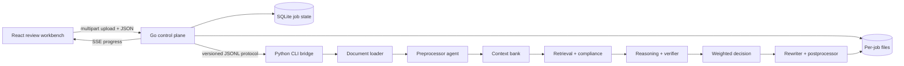

# System Architecture

ClauseGuard Agent is a modular contract-review pipeline. It separates document
parsing, extraction, retrieval, rule evaluation, model reasoning, verification,
decision scoring, rewriting, and reporting so each stage can be tested and
audited independently.

## Runtime Flow



The pipeline operates on one document at a time. Every clause, evidence item,
candidate, score, and rewrite carries a stable identifier so findings can be
traced back to source text.

The Go process owns transport, upload isolation, queue capacity, cancellation,
job persistence, and process timeouts. It invokes the Python engine through a
versioned JSON-lines event protocol instead of importing Python internals. This
keeps the UI/API lifecycle independent from analysis implementation details while
preserving structured progress and error semantics.

## Component Boundaries

| Component | Module | Contract |
|---|---|---|
| Review workbench | `apps/web` | React/TypeScript intake, live progress, reports, evidence, rewrites, comparison, and audit views |
| HTTP control plane | `apps/server/internal/api` | Validates uploads, exposes job/report/SSE endpoints, serves the production SPA, and applies browser security policy |
| Job manager and store | `apps/server/internal/jobs`, `apps/server/internal/store` | Enforces queue and timeout limits, persists SQLite state, supports cancellation, and recovers interrupted jobs |
| CLI process bridge | `apps/server/internal/engine` | Exchanges versioned JSONL events with the Python CLI and validates report paths |
| Document loader | `clauseguard.document` | Converts TXT, DOCX, or PDF input into normalized text and metadata |
| Preprocessor | `clauseguard.agents.preprocessor` | Produces document type, ordered clauses, entities, categories, and risk terms |
| Shared state | `clauseguard.context` | Owns the normalized single-document state used by all stages |
| Retrieval | `clauseguard.rag` | Ranks versioned review checklists for clauses and candidate issues |
| Compliance checks | `clauseguard.agents.compliance` | Emits structured candidates with rule IDs, signals, and deterministic confidence |
| Verification | `clauseguard.agents.verifier` | Requests a separate model assessment and records explicit verifier status |
| Decision scoring | `clauseguard.scoring` | Combines five bounded evidence channels and applies issue-specific thresholds |
| Rewriting | `clauseguard.agents.rewriter` | Drafts safer language for accepted clause-level findings |
| Reporting | `clauseguard.postprocessor` | Writes a human-readable report and the complete machine-readable audit record |

Pydantic models in `clauseguard.schemas` validate all cross-stage data. A model
response cannot become a finding until it has been parsed into these schemas and
passed through the decision layer.

## Retrieval Design

The local retriever combines token overlap with deterministic feature-hashed
token and bigram vectors. It is intentionally lightweight and reproducible:

```text
relevance = 0.65 * lexical overlap + 0.35 * vector cosine similarity
```

Clause-level retrieval provides category context. A second retrieval pass uses
the candidate issue, explanation, signals, and affected clause metadata to attach
issue-specific evidence before verification and scoring. The built-in corpus is
a review checklist, not a statutory database; it can be replaced or extended
without changing the agent contracts.

## Model Roles

| Role | Default model | Reason for separation |
|---|---|---|
| Extraction | `openai/gpt-oss-20b` | Structured document classification and clause extraction |
| Reasoning and rewriting | `qwen/qwen3.6-27b` | Contextual issue review, explanations, and revised language |
| Verification | `openai/gpt-oss-120b` | Separate model family reviews candidate support |
| Retrieval | `local-hash-lexical` | Deterministic local evidence ranking |

All hosted calls pass through `ModelRouter`. The router centralizes model-role
mapping, JSON parsing, HTTP timeouts, provider error handling, and per-run usage
guards. Unknown roles and malformed responses fail explicitly.

## Decision Layer

ClauseGuard uses application-level evidence weighting, not trained model weights:

```text
decision score =
    0.30 * deterministic rule confidence
  + 0.25 * retrieved evidence relevance
  + 0.20 * primary reasoning confidence
  + 0.15 * verifier agreement
  + 0.10 * clause structure confidence
```

Each component is constrained to `[0, 1]`. General acceptance starts at `0.55`;
broad issue families use higher calibrated thresholds. The JSON result preserves
the component values, weights, threshold, rule ID, signals, verifier status, and
acceptance decision.

A verifier result has one of three states:

- `verified`: a structured second-model result was received.
- `not_run`: deterministic evaluation mode used a neutral verifier component.
- `unavailable`: a hosted verifier returned no usable structured result.

This prevents a fallback from being presented as completed independent review.

## Analysis Modes

**Standalone analysis** processes one contract and produces findings and
rewrites. This is the primary product workflow.

**Document comparison** matches clauses from an original and modified agreement
and reports additions, removals, and changed safeguards. It is an inspection
workflow and is not used to generate standalone benchmark predictions. Before
matching, it canonicalizes whitespace and numbered-heading boundaries so PDF
line wrapping does not create artificial clause changes.

**Benchmark evaluation** supplies only each labeled contract to the standalone
pipeline. Original documents and perturbation metadata remain provenance. The
evaluator calculates case-level issue classification metrics and writes per-case,
per-issue, and aggregate error analysis.

## Failure Semantics

- Missing, empty, unsupported, encrypted, or corrupted documents raise a
  `DocumentLoadError` with a user-facing message.
- File size, archive expansion, archive entry count, PDF page count, and extracted
  text are bounded before a document can consume unbounded parser resources.
- Exact long-page duplicates from malformed PDF text layers are collapsed before
  clause extraction, while ordinary repeated short pages remain intact.
- Invalid configuration fails before the first hosted request.
- Per-run request and input-size guards fail before exceeding configured caps.
- Transport failures, rate limits, non-JSON HTTP responses, and malformed model
  payloads are represented by explicit model exceptions.
- Markdown is a concise review surface; JSON remains the complete audit record,
  including rejected candidates.

## Verification Strategy

The automated quality gate runs formatting, import ordering, linting, static type
checking, dependency audits, unit/integration tests, branch-aware coverage, Go
race detection, and production-stack Playwright journeys on desktop and mobile.
CodeQL scans Python, Go, and TypeScript. Provider smoke tests remain isolated from
the reproducible CI path.
